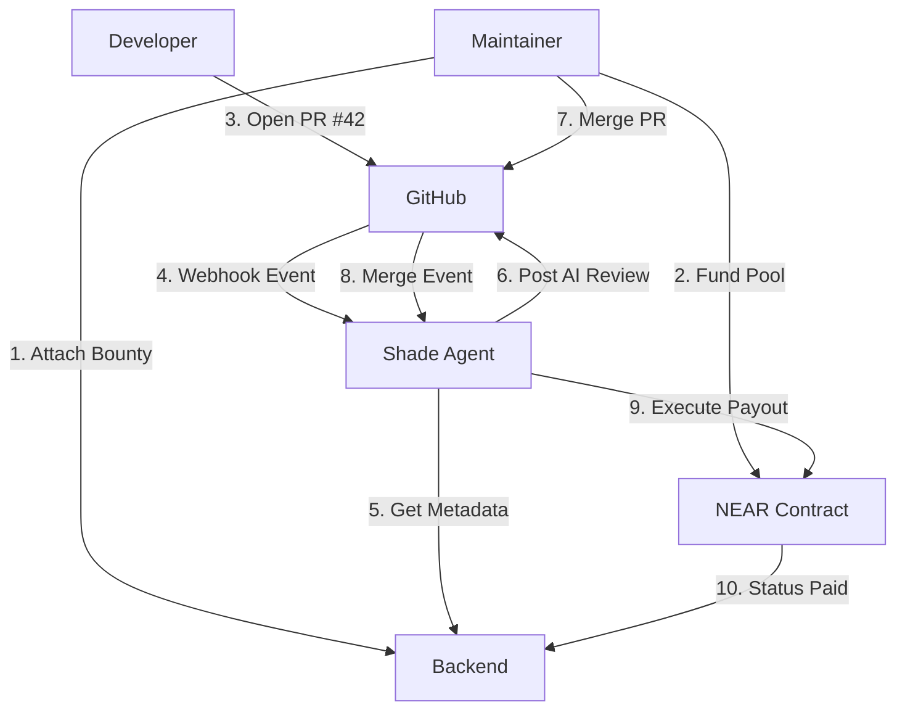

# Holy: The AI Code Review & Bounty Protocol

**Holy** is a decentralized, AI-driven code review and bounty platform built on the **NEAR Blockchain**. It empowers maintainers to automate high-quality code reviews and reward contributors instantly upon merge, all within a secure, Trusted Execution Environment (TEE).

---

## Vision
Bridge the gap between open-source contributions and fair compensation. Holy acts as an autonomous agent that monitors your repository, providing deep AI-driven insights and handling financial payouts with zero manual intervention.

## Key Features

### Autonomous AI Reviews
- Integrated with Groq, OpenAI, and DeepSeek for lightning-fast, high-context reviews.
- Custom review criteria per repository.
- **Bounty Alerts**: The agent automatically detects bounties and notifies contributors in the PR.

### Blockchain-Powered Bounties
- **Instant Payouts**: Funds are released from a NEAR smart contract only when a maintainer merges a PR.
- **Multi-Bounty Support**: Attach bounties to Issues to attract talent, or directly to PRs for rewards.
- **Auto-Linking**: PRs containing "Fixes #123" are automatically linked to existing issue bounties.

### GitHub Slash Commands
- **`/bounty 10`**: Set a bounty on an issue directly from a GitHub comment.
- **`/link-wallet name.testnet`**: Contributors can link their NEAR wallet in seconds.

### Trusted Execution Environment (TEE)
- Sensitive operations (payouts and private key management) occur within a Phala TEE.
- Tamper-proof logs and secure key isolation for the Shade Agent.

---

## Architecture: The "Triple Handshake"

Holy operates through a seamless coordination between three layers:

1.  **Backend (Prisma + Express)**: Manages the source of truth, user auth, and repository metadata.
2.  **Shade Agent (TEE + AI)**: The autonomous worker that listens to GitHub webhooks, reviews code, and pings the blockchain.
3.  **NEAR Protocol (Smart Contracts)**: The trustless vault that holds and releases funds based on the Agent's signature.



---

## Getting Started

### 1. Prerequisites
- **Node.js 18+**
- **PostgreSQL**
### 2. Installation
```bash
# Clone the repo
git clone https://github.com/jerrygeorge360/Holy.git
cd Holy	

# Install dependencies for both services
cd backend && npm install
cd ../shadeagent/shade-agent-v2 && npm install
```

### 3. Environment Setup
Create a `.env` in both folders (see `.env.example` in each directory).
Key variables needed: `GITHUB_WEBHOOK_SECRET`, `MAINTAINER_SECRET`, `NEAR_ACCOUNT_ID`.

---

## Testing the Flow

### Manual API Testing
Use the following endpoints to test the system end-to-end:

| Step | Action | Endpoint | Auth |
| :--- | :--- | :--- | :--- |
| 1 | **Connect Repo** | `POST /api/repos/connect` | User JWT |
| 2 | **Link Wallet** | `PUT /api/repos/owner/repo` | User JWT |
| 3 | **Attach Bounty** | `POST /api/bounty/attach` | User JWT / Agent Secret |
| 4 | **Get Issues** | `GET /api/repos/owner/repo/issues` | User JWT |
| 5 | **Manual Release**| `POST /api/bounty/release` | Agent Secret |

### Live GitHub Testing
1. **Comment `/bounty 0.5`** on any GitHub issue. The bot will automatically sync this to the backend.
2. **Open a PR** with "Fixes #IssueNumber". The bot will announce the bounty and review the code.
3. **Merge the PR**. The NEAR payout will be triggered automatically.

---

## Directory Structure
- `backend/`: Express server, Prisma schemas, and API routes.
- `shadeagent/`: The Shade Agent V2 template, including AI services and NEAR blockchain logic.
- `frontend/`: (In Progress) Next.js dashboard for maintainers.

## Documentation
- [Comprehensive API Guide](.brain/api_documentation.md)
- [Shade Agent README](shadeagent/shade-agent-v2/README.md)

---
**Maintained by jerrygeorge360**
